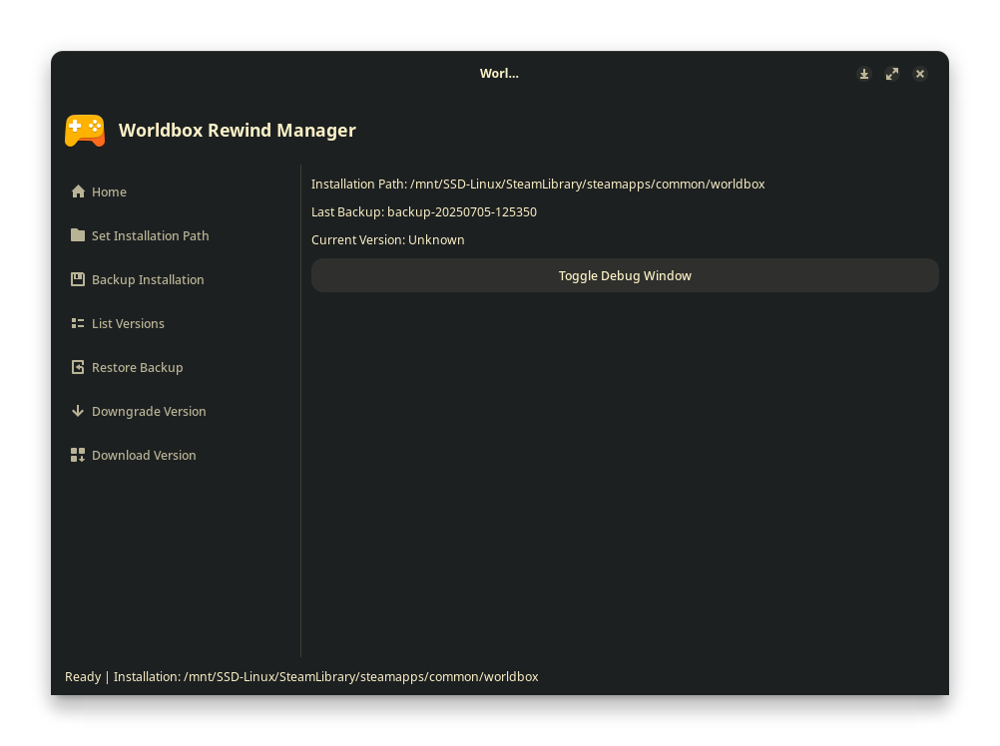
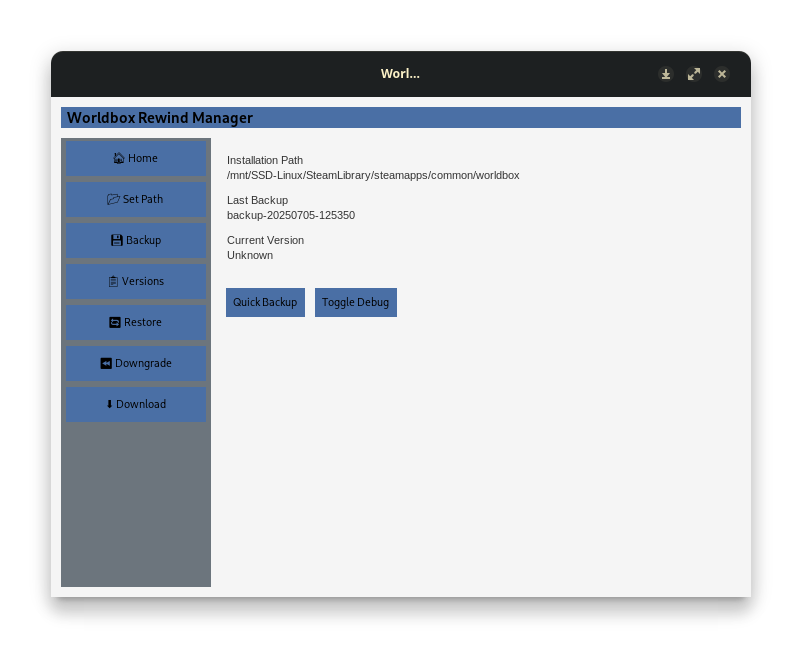

# 🌍 Worldbox Rewind


</br>
A simple tool to downgrade WorldBox using SteamCMD and manifest IDs because every fucking update breaks mods. Yippe.

</br>

## ✨ Features

* Pick a platform: Windows, Linux, or Mac
* Enter any manifest ID to download a specific version
* Bulk download multiple manifest IDs from a text file
* Step-by-step manifest guide included
* Version Manager with backup, restore, downgrade capabilities

</br>

## ✅ Requirements

* Python 3.8 or newer
* [SteamCMD](https://developer.valvesoftware.com/wiki/SteamCMD) installed and in your system PATH (SteamCMD comes packaged with the Windows version, other Operating Systems still need to install it!)


</br>

## 🛠️ Setup

1. Clone or download this repo.
2. Install dependencies:

```bash
pip install -r requirements.txt
```

3. Run the tool:

For single or interactive download:

```bash
python rewind.py
```

For bulk downloading from a list of manifest IDs:

```bash
python bulk_rewind.py
```

For managing versions and backups:

```bash
python manager.py
```
### OR

Use the Binaries provided in the Releases Tab, though SteamCMD is still required!

### OR

Use the GUI Version, experimental (SteamCMD still required tho!)

</br>

## 📚 How to Use

### Rewind.py (Single Download)

1. Choose your platform (Windows, Linux, Mac).
2. Follow the instructions to find a manifest ID on SteamDB.
3. Enter the manifest ID.
4. The version will be downloaded and saved.

### Manager.py (Version Manager)

1. Set your installation path.
2. Backup your current installation.
3. List available backups and versions.
4. Restore a backup or downgrade to a selected version.

### WorldBox Rewind Manager GUI (EXPERIMENTAL)
1. Run the GUI executable.
2. Explore the GUI
3. Profit

</br>

## 📁 Downloads Saved In

```
/versions/
  ├── Windows/
  ├── Linux/
  └── Mac/
```

Backups are saved in:

```
/backups/
```

</br>

## 📸 Example

### CLI Version

```bash
$ python rewind.py
 Worldbox Rewind
Select your platform:
1. Windows
2. Linux
3. Mac

Enter manifest ID: 1234567890123456789
Downloading...
 Successfully saved version to: versions/Windows/1234567890123456789
```

### GUI Version (EXPERIMENTAL)
</br>

Linux:

</br>



</br>

Windows:

</br>




</br>

## 🔐 Steam Login

* You'll be prompted to log in with your Steam username and password.
* Steam Guard is supported (you may need to approve via mobile app).

</br>

## TODO
- [ ] Automatic ID fetching(?)
- [x] Version Manager
- [x] GUI Version (maybe)
- [x] Actual proper SteamGuard compatibility

</br>

## ⚠️ Disclaimer

This tool only uses official SteamCMD functionality. You must own WorldBox on Steam to download any content.
